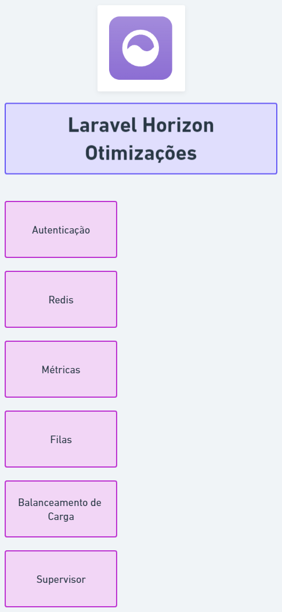

# Laravel Horizon Otimizações

Nesta aplicação iremos boas práticas com o Laravel Horizon afim de melhor o seu uso em ambientes de produção.

## Comandos Docker

Acesse [comandos úteis do Docker para aplicação](./docker/README.md)

## Requirimento:

-   Redis
-   Laravel Horizon
-   Supervisor

## Autenticação:

Ajustes necessários:

-   `.env` -> Definir `APP_ENV` a chave para o valor de `production`
-   `.env` -> Definir `QUEUE_CONNECTION` a chave para o valor de `redis`
-   `.env` -> Adicionar chave `HORIZON_BASIC_AUTH_USERNAME`, o valor será utilizado como usuário de login ao painel do horizon.
-   `.env` -> Adicionar chave `HORIZON_BASIC_AUTH_PASSWORD`, o valor será utilizado como senha de login ao painel do horizon.

-   `app/Providers/HorizonServiceProvider.php` -> Comentar o método `gate`
-   `app/Providers/HorizonServiceProvider.php` -> Implementar método `authorization`

-   `HorizonBasicAuthMiddleware` -> Executar no CLI o comando `php artisan make:middleware HorizonBasicAuthMiddleware`
-   `app/Http/Middleware/HorizonBasicAuthMiddleware.php` -> Implementar o método `handle`

-   `config/horizon.php` -> Adicionar campo `basic_auth` com as chaves e valores `username` igual à `env('HORIZON_BASIC_AUTH_USERNAME', 'horizon'),` e `password` igual à `env('HORIZON_BASIC_AUTH_PASSWORD', 'password')`
-   `config/horizon.php` -> Adicionar em `middleware` o valor `horizonBasicAuth`

-   `app/Http/Kernel.php` -> Adicionar em `middlewareAliases` a chave e `horizonBasicAuth` com valor `\App\Http\Middleware\HorizonBasicAuthMiddleware::class`

## Redis:

-   `.env` -> Definir `QUEUE_CONNECTION` a chave para o valor de `redis`
-   `config/database.php` -> Criar conexão Redis `horizon`
-   `config/horizon.php` -> Alterar Horizon Redis Connection

## Métricas:

-   `config/horizon.php` -> Realizar ajustes em `metrics` e `trim`
-   `app/Console/Kernel.php` -> Implementar em `schedule` com o comando `$schedule->command('horizon:snapshot')->everyFiveMinutes();`

## Filas:

-   `config/horizon.php` -> Aplicar filas

## Balanceamento de Carga:

-   `config/horizon.php` -> Ajustar `balance` para `auto`

## Supervisor

-   `supervisor` -> Realizar configurações para mais 'programs' e vincular a filas.

## Outras configurações:

-   Alterar path do Horizon. `.env` aplicar variavel `HORIZON_PATH` com valor igual ao caminho desejado.
-   Aplicar tags em Jobs
-   Aplicar ShouldBeUnique ou ShouldBeUniqueUntilProcessing
-   Comandos do supervisor
-   CronJob
-   Criar Job
-   Quantidade de Processos
-   Dúvidas
